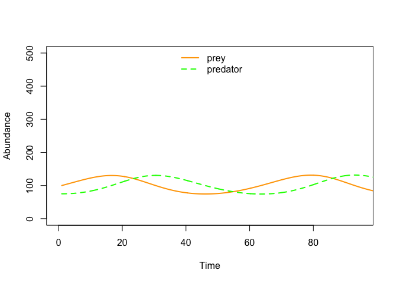
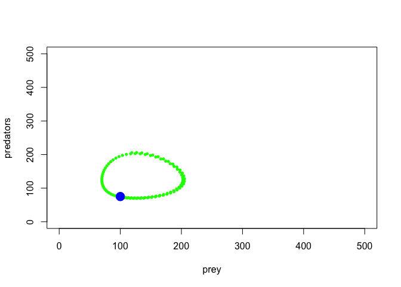
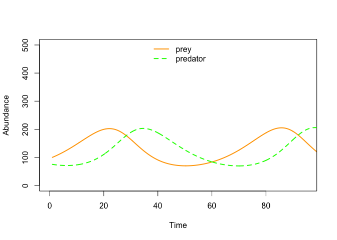
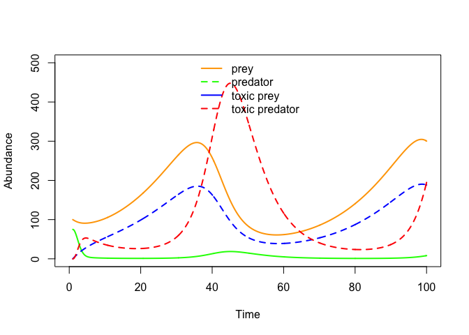
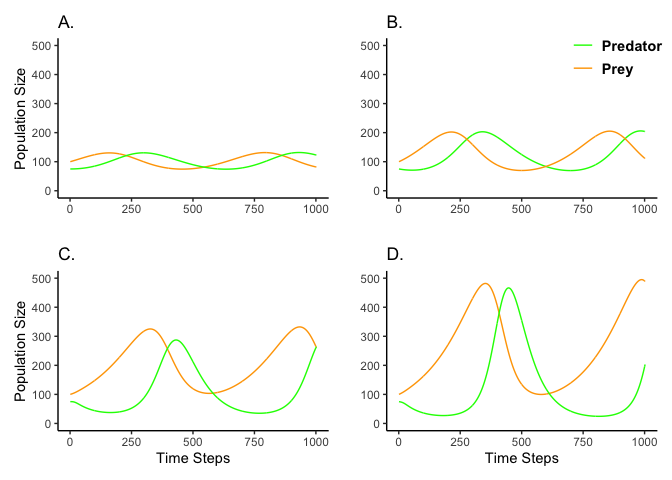
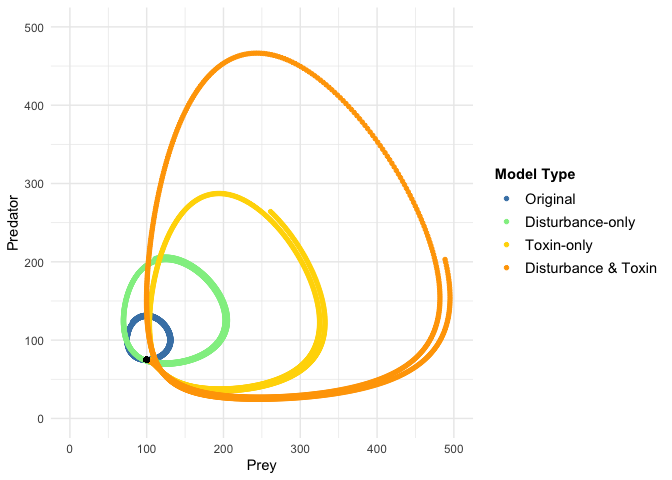

toxin-disturbance
================
Amy Van Scoyoc
10/13/2020

``` r
library(tidyverse)
```

    ## ── Attaching packages ────────────────────────────────────────────────────────────────── tidyverse 1.3.0 ──

    ## ✓ ggplot2 3.3.2     ✓ purrr   0.3.4
    ## ✓ tibble  3.0.3     ✓ dplyr   1.0.2
    ## ✓ tidyr   1.1.0     ✓ stringr 1.4.0
    ## ✓ readr   1.3.1     ✓ forcats 0.5.0

    ## ── Conflicts ───────────────────────────────────────────────────────────────────── tidyverse_conflicts() ──
    ## x dplyr::filter() masks stats::filter()
    ## x dplyr::lag()    masks stats::lag()

# Original Lotka-Volterra

\[\Delta H = rH-bHP\] \[\Delta P = aHP-qP\]

``` r
## Params
a <- 0.001 #predator gain
b <- 0.001 #prey consumed
H0 <- 100 #number of prey
P0 <- 75 #number of predators
r <- 0.1 #prey growth rate
q <- 0.1 #predator growth rate (declines without prey)
Nyears <- 1000
step <- 0.1

Orig <- data.frame(prey = rep(H0,Nyears), pred = P0)

doYear <- function(x){
  n1 <- x[1] + r*x[1]*step - b*x[1]*x[2]*step
  n2 <- x[2] + a*x[1]*x[2]*step - q*x[2]*step 
  return(c(n1,n2))
}

## Do simulation
for(i in 1:(Nyears+1)){
  Orig[1+i,] <- doYear(Orig[i,])
}

#plot 1
plot(1,1,pch="",ylim=c(0,500),xlim=c(0,500),xlab="prey",ylab="predators")
points(Orig[seq(1,1000,10),],col="green",type="p",pch=20,cex=0.85)
points(Orig[1,],col="blue",pch=20,cex=3)
```

<!-- -->

``` r
#plot 2
plot(seq(1,100,length=nrow(Orig)), Orig[,1], xlab="Time", ylab="Abundance",type="l",col="orange",lwd=2,ylim=c(0,500),xlim=c(0,95))
points(seq(1,100,length=nrow(Orig)), Orig[,2], xlab="Time", ylab="Abundance",type="l",col="green",lwd=2,lty=2)
legend("top",lwd=c(2,2),lty=c(1,2),col=c("orange","green"),legend=c("prey","predator"),bty="n")
```

<!-- -->

# Disturbance only

\[\Delta H = rH-bZHP\] \[\Delta P = ZaHP-qP\]

``` r
## New Param
z <- 0.8 #probability of pred-prey overlap given disturbance

## Old Params
a <- 0.001 #predator gain
b <- 0.001 #prey consumed
H0 <- 100 #number of prey
P0 <- 75 #number of predators
r <- 0.1 #prey growth rate
q <- 0.1 #predator growth rate (declines without prey)
Nyears <- 1000
step <- 0.1

Dist <- data.frame(prey = rep(H0,Nyears),pred = P0)

doYear <- function(x){
  n1 <- x[1] + r*x[1]*step - z*b*x[1]*x[2]*step
  n2 <- x[2] + z*a*x[1]*x[2]*step - q*x[2]*step 
  return(c(n1,n2))
}

## Do simulation
for(i in 1:(Nyears+1)){
  Dist[1+i,] <- doYear(Dist[i,])
}

#plot 1
plot(1,1,pch="",ylim=c(0,500),xlim=c(0,500),xlab="prey",ylab="predators")
points(Dist[seq(1,1000,10),],col="green",type="p",pch=20,cex=0.85)
points(Dist[1,],col="blue",pch=20,cex=3)
```

<!-- -->

``` r
#plot 2
plot(seq(1,100,length=nrow(Dist)), Dist[,1], xlab="Time", ylab="Abundance",type="l",col="orange",lwd=2,ylim=c(0,500),xlim=c(0,95))
points(seq(1,100,length=nrow(Dist)), Dist[,2], xlab="Time", ylab="Abundance",type="l",col="green",lwd=2,lty=2)
legend("top",lwd=c(2,2),lty=c(1,2),col=c("orange","green"),legend=c("prey","predator"),bty="n")
```

<!-- -->

# Toxins only

\[\Delta H = r(H + H_t) - b(1-p)HP - b(1-m)HP_t - uH\]
\[\Delta H_t = uH - b(p)H_tP - b(m)H_tP_t - dH_t\]
\[\Delta P = a(H + H_t)(H_t + P_t) - pH_tP - qP\]
\[\Delta P_t = pH_tP - (q + d)P_t\]

``` r
## New Param
HT0 <- 0 #number of toxic prey x[3]
PT0 <- 0 #number of toxic predators x[4]
p <- 0.05 #proportion of predators eating toxic prey
m <- 0.5 #proportion of toxic predators eating toxic prey
d <- 0.1 #toxin mortality
u <- 0.1 #rate of prey eating toxins 

## Old Params
a <- 0.001 #predator gain
b <- 0.001 #prey consumed
H0 <- 100 #number of prey x[1]
P0 <- 75 #number of predators x[2] 
r <- 0.1 #prey growth rate
q <- 0.1 #predator growth rate (declines without prey)
Nyears <- 1000
step <- 0.1

Toxic <- data.frame(prey = rep(H0,(Nyears+1)),pred = P0, Tprey = HT0, Tpred = PT0)

doYear <- function(x){
  H <- x[1] + r*(x[1] + x[3])*step - b*(1-p)*x[1]*x[2]*step - b*(1-m)*x[1]*x[4]*step - u*x[1]*step
  
  HT <- x[3] + u*x[1]*step - b*(p)*x[3]*x[2]*step - b*(m)*x[3]*x[4]*step - d*x[3]*step
  
  P <- x[2] + a*(x[1] + x[3])*(x[2] + x[4])*step - p*x[3]*x[2]*step - q*x[2]*step 
  
  PT <- x[4] + p*x[3]*x[2]*step - (q + d)*x[4]*step
  
#+ a*(1-m)*x[1]*x[4]*step + a*(m)*x[3]*x[4]*step #use if you want to reproduce toxic prey...
  return(c(H,P,HT,PT))
}

## Do simulation
for(i in 1:(Nyears+1)){
  Toxic[1+i,] <- doYear(Toxic[i,])
}

#plot 1
plot(seq(1,100,length=nrow(Toxic)), Toxic[,1], xlab="Time", ylab="Abundance",type="l",col="orange",lwd=2,ylim=c(0,500),xlim=c(0,100))
points(seq(1,100,length=nrow(Toxic)), Toxic[,2], xlab="Time", ylab="Abundance",type="l",col="green",lwd=2)
points(seq(1,100,length=nrow(Toxic)), Toxic[,3], xlab="Time", ylab="Abundance",type="l",col="blue",lwd=2,lty=2)
points(seq(1,100,length=nrow(Toxic)), Toxic[,4], xlab="Time", ylab="Abundance",type="l",col="red",lwd=2,lty=2)
legend("top",lwd=c(2,2),lty=c(1,2),col=c("orange","green","blue","red"),legend=c("prey","predator","toxic prey","toxic predator"),bty="n")
```

<!-- -->

# Disturbance & Toxins

\[\Delta H = r(H + H_t) - Zb(1-p)HP - Zb(1-m)HP_t - uH\]
\[\Delta H_t = uH - Zb(p)H_tP - Zb(m)H_tP_t - dH_t\]
\[\Delta P = Za(H + H_t)(Ht + P_t) - pH_tP - qP\]
\[\Delta P_t = pH_tP - (q + d)P_t\]

``` r
## New Param
HT0 <- 0 #number of toxic prey x[3]
PT0 <- 0 #number of toxic predators x[4]
p <- 0.05 #proportion of predators eating toxic prey
m <- 0.5 #proportion of toxic predators eating toxic prey
d <- 0.1 #toxin mortality
u <- 0.1 #rate of prey eating toxins 
z <- 0.8 #overlap between predator and prey

## Old Params
a <- 0.001 #predator gain
b <- 0.001 #prey consumed
H0 <- 100 #number of prey x[1]
P0 <- 75 #number of predators x[2] 
r <- 0.1 #prey growth rate
q <- 0.1 #predator growth rate (declines without prey)
Nyears <- 1000
step <- 0.1

Distox <- data.frame(prey = rep(H0,(Nyears+1)),pred = P0, Tprey = HT0, Tpred = PT0)

doYear <- function(x){
  H <- x[1] + r*(x[1] + x[3])*step - z*b*(1-p)*x[1]*x[2]*step - z*b*(1-m)*x[1]*x[4]*step - u*x[1]*step
  
  HT <- x[3] + u*x[1]*step - z*b*(p)*x[3]*x[2]*step - z*b*(m)*x[3]*x[4]*step - d*x[3]*step
  
  P <- x[2] + z*a*(x[1] + x[3])*(x[2] + x[4])*step - p*x[3]*x[2]*step - q*x[2]*step 
  
  PT <- x[4] + p*x[3]*x[2]*step - (q + d)*x[4]*step
  
#+ a*(1-m)*x[1]*x[4]*step + a*(m)*x[3]*x[4]*step #use if you want to reproduce toxic prey...
  return(c(H,P,HT,PT))
}

## Do simulation
for(i in 1:(Nyears+1)){
  Distox[1+i,] <- doYear(Distox[i,])
}

#plot 1
plot(seq(1,100,length=nrow(Distox)), Distox[,1], xlab="Time", ylab="Abundance",type="l",col="orange",lwd=2,ylim=c(0,500),xlim=c(0,100))
points(seq(1,100,length=nrow(Distox)), Distox[,2], xlab="Time", ylab="Abundance",type="l",col="green",lwd=2)
points(seq(1,100,length=nrow(Distox)), Distox[,3], xlab="Time", ylab="Abundance",type="l",col="blue",lwd=2,lty=2)
points(seq(1,100,length=nrow(Distox)), Distox[,4], xlab="Time", ylab="Abundance",type="l",col="red",lwd=2,lty=2)
legend("top",lwd=c(2,2),lty=c(1,2),col=c("orange","green","blue","red"),legend=c("prey","predator","toxic prey","toxic predator"),bty="n")
```

<!-- -->

## Figure 2.

``` r
#Reformat to combine toxic populations with regular
Toxic2 <- Toxic %>% 
  transmute(prey = prey + Tprey, 
            pred = pred + Tpred)
#Reformat to combine toxic populations with regular
Distox2 <- Distox %>% 
  transmute(prey = prey + Tprey, 
         pred = pred + Tpred)
#create timesteps to graph
Toxic2$x <- 1:1002
Orig$x <-  1:1002
Dist$x <-  1:1002
Distox2$x <-  1:1002

#Plots
p1 <- ggplot(Orig) + 
        geom_line(aes(x = x, y = prey), color = "orange") + 
        geom_line(aes(x = x, y = pred), color = "green") + 
        ylim(0,500) +
        ggtitle("A.") +
        labs(y="Population Size", x = "") +
        theme_classic()

#legend parameters
colors <- c("prey" = "orange", "pred" = "green")
df <- Dist %>% pivot_longer(prey:pred)

p2dist <- ggplot(df, aes(x=x)) + 
        geom_line(aes(y = value, color = name)) + 
        ylim(0,500) +
        ggtitle("B.") +
        labs(y="", x = "", color = "") +
        scale_color_manual(labels = c("Predator","Prey"),values = colors) +
        theme_classic() + 
        theme(legend.text = element_text(size=11, face="bold"), 
              legend.position = c(.85, .95))

p3tox <- ggplot(Toxic2) + 
        geom_line(aes(x = x, y = prey), color = "orange") + 
        geom_line(aes(x = x, y = pred), color = "green") +
        ylim(0,500) +
        ggtitle("C.") +
        labs(y="Population Size", x = "Time Steps") +
        theme_classic()

p4distox <- ggplot(Distox2) + 
        geom_line(aes(x = x, y = prey), color = "orange") + 
        geom_line(aes(x = x, y = pred), color = "green") +
        ylim(0,500) +
        ggtitle("D.") +
        labs(y="", x = "Time Steps") +
        theme_classic()

#combine plots
library(patchwork)
(p1 / p3tox | p2dist / p4distox)
```

<!-- -->

## Figure 3

``` r
#Reformat to graph
full_dat <- bind_rows("Original" = Orig, "Disturbance-only" = Dist, "Toxin-only" = Toxic2, 
                      "Disturbance & Toxin" = Distox2, .id = "Model_Type") %>%
            mutate(Model_Type = fct_relevel(Model_Type, "Original", 
                                            "Disturbance-only", "Toxin-only", "Disturbance & Toxin"))
#Phase Planes
ggplot(full_dat, aes(x = prey, y = pred, color = Model_Type)) +
        geom_point(size=1.2) +
        geom_point(aes(prey[1],pred[1]), color = "black") +
        #graph parameters
        xlim(0,500) +
        ylim(0,500) +
        labs(y="Predator", x = "Prey", color = "Model Type") +
        theme_minimal() + 
        scale_color_manual(values = c("steelblue", "lightgreen", "gold", "orange")) + 
        theme(legend.text = element_text(size=11),
              legend.title = element_text(face="bold"))
```

<!-- -->
